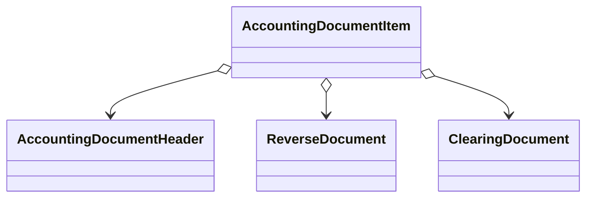

# ElAccountingGl

**TODO: Add description**

## Installation

If [available in Hex](https://hex.pm/docs/publish), the package can be installed
by adding `el_accounting_gl` to your list of dependencies in `mix.exs`:

```elixir
def deps do
  [
    {:el_accounting_gl, "~> 0.1.0"}
  ]
end
```

Documentation can be generated with [ExDoc](https://github.com/elixir-lang/ex_doc)
and published on [HexDocs](https://hexdocs.pm). Once published, the docs can
be found at <https://hexdocs.pm/el_accounting_gl>.

## General Ledger Data Items Aggregation



| Object | Data Item |
|--------|-----------|
| Root (AccountingDocumentItem)   | FiscalYear |
| Root (AccountingDocumentItem)   | AccountingArea |
| Root (AccountingDocumentItem)   | AccountingDocumentNumber |
| Root (AccountingDocumentItem)   | AccountingUnit |
| Root (AccountingDocumentItem)   | AccountingDocumentItemNumber |
| Root (AccountingDocumentItem) | DebitCredit |
| AccountingDocumentHeader | DocumentType |
| AccountingDocumentHeader | PostingDate |
| AccountingDocumentHeader   | AccountingPeriod |
| AccountingDocumentHeader | DocumentDate |
| AccountingDocumentHeader | EntryDate |
| AccountingDocumentHeader | EnteredAt |
| AccountingDocumentHeader | EnteredBy |
| AccountingDocumentHeader | PostedBy |
| ReverseDocument | ReverseDocumentIndicator |
| ReverseDocument | ReversedDocumentAccountingUnit |
| ReverseDocument | ReversedDocumentAccountingDocument |
| ReverseDocument | ReversedDocumentAccountingDocumentItem |
| ReverseDocument | ReversedDocumentAccountingPeriod |
| ClearingDocument | ClearingDocumentIndicator |
| ClearingDocument | ClearedDocumentAccountingUnit |
| ClearingDocument | ClearedDocumentAccountingDocument |
| ClearingDocument | ClearedDocumentAccountingDocumentItem |
| ClearingDocument | ClearedDocumentAccountingPeriod |
| HeaderReference | ReferenceArea |
| HeaderReference | ReferenceKey |
| GeneralLedgerTransaction | GeneralLedgerAccountTransactionType |
| GeneralLedgerTransaction | GeneralLedgerAccount |
| VendorTransaction | VendorTransactionType |
| VendorTransaction | Vendor |
| CustomerTransaction | CustomerTransactionType |
| CustomerTransaction | Customer |
| FixedAssetTransaction | FixedAssetTransactionType |
| FixedAssetTransaction | FixedAsset |
| MaterialTransaction | MaterialTransactionType |
| MaterialTransaction | Material |
| BankTransaction | BankTransactionType |
| BankTransaction | Bank |
| ProfitCenterTransaction | ProfitCenterTransactionType |
| ProfitCenterTransaction | ProfitCenter |
| FunctionalAreaTransaction | FunctionalAreaTransactionType |
| FunctionalAreaTransaction | FunctionalArea |
| CostCenterTransaction | CostCenterTransactionType |
| CostCenterTransaction | CostCenter |
| OrderTransaction | OrderTransactionType |
| OrderTransaction | Order |
| WBSElementTransaction | WBSElementTransactionType |
| WBSElementTransaction  | WBSElement |
| SalesOrderTransaction | SalesOrderTransactionType |
| SalesOrderTransaction | SalesOrder |
| SalesOrderItemTransaction | SalesOrderItemTransactionType |
| SalesOrderItemTransaction | SalesOrderItem |
| PartnerAccount | PartnerAccountingUnit |
| PartnerAccount | PartnerProfitCenter |
| PartnerAccount | PartnerCostCenter |
| PartnerAccount | PartnerFunctionalArea |
| AccountingUnitCurrencyAmount | AccountingUnitCurrency |
| AccountingUnitCurrencyAmount | AmountOfAccountingUnitCurrency |
| AccountingUnitCurrencyAmount | ExchangeRateType |
| AccountingUnitCurrencyAmount | ExchangeRate |
| AccountingUnitCurrencyAmount | ExchangeDate |
| TransactionCurrencyAmount | TransactionCurrency |
| TransactionCurrencyAmount | AmountOfTransactionUnitCurrency |
| AccountingAreaCurrency | AccountingAreaCurrency |
| AccountingAreaCurrency | AmountOfAccountingAreaCurrency |
| AccountingAreaCurrencyAmount | ExchangeRateType |
| AccountingAreaCurrencyAmount | ExchangeRate |
| AccountingAreaCurrencyAmount | ExchangeDate |
| OffsettingItem | OffsettingGeneralLedgerAccount |
| OffsettingItem | OffsettingVendor |
| OffsettingItem | OffsettingCustomer |
| OffsettingItem | OffsettingFixedAsset |
| OffsettingItem | OffsettingMaterial |
| OffsettingItem | OffsettingBank |
| OffsettingItem | OffsettingProfitCenter |
| OffsettingItem | OffsettingCostCenter |
| OffsettingItem | OffsettingFunctionalArea |
| OffsettingItem | OffsettingWBSElement |
| VAT | VATCode |
| VAT | VATAmountOfAccountingUnitCurrency |
| VAT | VATAmountOfTransactionUnitCurrency |
| VAT | VATAmountOfAccountingAreaCurrency |
| VAT | VATBaseAmountOfAccountingUnitCurrency |
| VAT | VATBaseAmountOfTransactionUnitCurrency |
| VAT | VATBaseAmountOfAccountingAreaCurrency |


## General Ledger 
