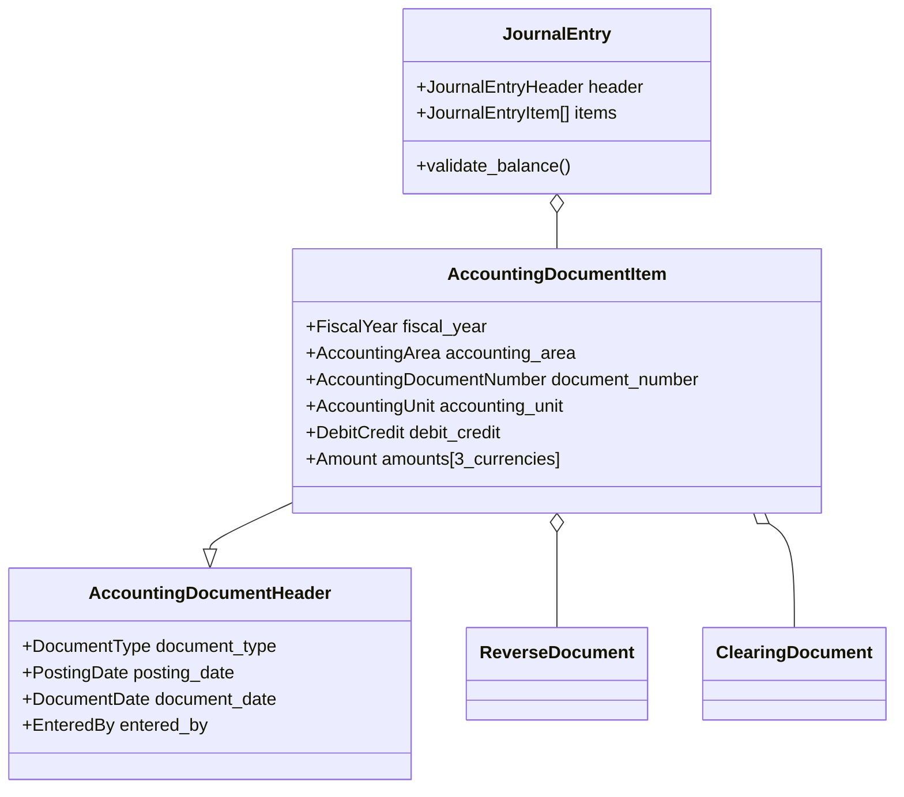

# ExAccounting

[](https://github.com/skusunoki/ex_accounting/actions)
[](https://hex.pm/packages/ex_accounting)
[](https://hexdocs.pm/ex_accounting)

ExAccounting is a comprehensive double-entry accounting system built with Elixir. It provides a robust foundation for enterprise-level financial management with support for multiple currencies, complex organizational structures, and comprehensive audit trails.

## Features

### Core Accounting
- **Double-Entry Bookkeeping**: Strict adherence to double-entry principles with automatic debit/credit balance validation
- **Multi-Currency Support**: Three-tier currency system (Transaction, Accounting Unit, Accounting Area currencies)
- **General Ledger**: Complete general ledger implementation with detailed transaction tracking
- **Document Number Management**: Automatic document number generation with configurable number ranges

### Enterprise Features
- **Multi-Entity Support**: Handle multiple accounting units and areas within a single system
- **Cost Center Accounting**: Full cost center and profit center management
- **Asset Accounting**: Fixed asset transaction support
- **Project Accounting**: WBS (Work Breakdown Structure) element tracking
- **Customer/Vendor Management**: Comprehensive accounts receivable and payable
- **VAT/Tax Processing**: Built-in VAT calculation and reporting capabilities

### Technical Features
- **Type Safety**: Extensive use of custom Elixir types for domain modeling
- **Data Integrity**: Comprehensive validation and constraint checking
- **Audit Trail**: Complete transaction history and document references
- **Concurrent Processing**: Built on Elixir/OTP for high concurrency and fault tolerance
- **Database Agnostic**: Uses Ecto for flexible database support (PostgreSQL recommended)

## Architecture

ExAccounting follows a layered architecture pattern:

```
┌─────────────────────────┐
│     Business Logic      │  ← Journal Entry, Validation
├─────────────────────────┤
│   Embedded Schemas      │  ← Domain Models
├─────────────────────────┤
│      Schemas           │  ← Database Entities
├─────────────────────────┤
│     Elements (Elem)     │  ← Primitive Types
├─────────────────────────┤
│     Configuration      │  ← System Configuration
├─────────────────────────┤
│        State           │  ← Document Number Management
└─────────────────────────┘
```

### Data Model Overview



## Installation

Add `ex_accounting` to your list of dependencies in `mix.exs`:

```elixir
def deps do
  [
    {:ex_accounting, "~> 0.1.0"}
  ]
end
```

## Configuration

Configure your database connection in `config/config.exs`:

```elixir
config :ex_accounting, ExAccounting.Repo,
  database: "ex_accounting_repo",
  username: "postgres",
  password: "postgres",
  hostname: "localhost"

config :ex_accounting, ecto_repos: [ExAccounting.Repo]
```

## Quick Start

### 1. Database Setup

Create and migrate your database:

```bash
mix ecto.create
mix ecto.migrate
```

### 2. Start the Application

```elixir
# Start the OTP application
{:ok, _} = Application.ensure_all_started(:ex_accounting)
```

### 3. Create a Journal Entry

```elixir
alias ExAccounting.EmbeddedSchema.JournalEntry
alias ExAccounting.EmbeddedSchema.JournalEntryHeader
alias ExAccounting.EmbeddedSchema.JournalEntryItem

# Create a simple journal entry
journal_entry = %JournalEntry{
  header: %JournalEntryHeader{
    accounting_unit_attr: %{
      accounting_area: %{accounting_area: "0001"},
      accounting_unit: "1000"
    },
    transaction_currency: "USD",
    document_type: "SA",
    posting_date: ~D[2024-01-15]
  },
  item: [
    %JournalEntryItem{
      general_ledger_transaction: %{
        general_ledger_account: "100000",
        debit_credit: %{debit_credit: :debit},
        transaction_value: %{amount: Decimal.new("1000"), currency: "USD"},
        accounting_area_value: %{amount: Decimal.new("1000"), currency: "USD"}
      }
    },
    %JournalEntryItem{
      general_ledger_transaction: %{
        general_ledger_account: "400000",
        debit_credit: %{debit_credit: :credit},
        transaction_value: %{amount: Decimal.new("1000"), currency: "USD"},
        accounting_area_value: %{amount: Decimal.new("1000"), currency: "USD"}
      }
    }
  ]
}

# Validate and process the journal entry
changeset = JournalEntry.changeset(%JournalEntry{}, journal_entry)
if changeset.valid? do
  # Process the valid journal entry
  {:ok, processed_entry} = ExAccounting.Repo.insert(changeset)
end
```

### 4. Issue Document Numbers

```elixir
# Issue a new accounting document number
{:ok, document_number} = ExAccounting.issue_accounting_document_number("0001", "01")
```

## Key Concepts

### Accounting Areas and Units
- **Accounting Area**: Top-level organizational unit (e.g., legal entity)
- **Accounting Unit**: Sub-unit within an area (e.g., company code, branch)

### Document Types
Various document types are supported:
- `SA` - Sales documents
- `KA` - Vendor documents  
- `DG` - Customer documents
- Custom document types can be configured

### Multi-Currency Architecture
1. **Transaction Currency**: Original transaction currency
2. **Accounting Unit Currency**: Local currency of the accounting unit
3. **Accounting Area Currency**: Reporting currency of the accounting area

### Number Range Management
Document numbers are automatically assigned based on configurable number ranges:
- Different ranges for different document types
- Fiscal year-dependent numbering
- Gap-free or non-gap-free sequences

## API Reference

### Core Functions

#### `ExAccounting.issue_accounting_document_number/3`
Issues a new accounting document number within the specified number range.

```elixir
@spec issue_accounting_document_number(
  String.t(),              # number_range_code
  function(),              # current_value_reader
  function()               # config_reader
) :: {:ok, any} | {:error, any}
```

#### `JournalEntry.changeset/2`
Validates and processes journal entries ensuring double-entry compliance.

```elixir
@spec changeset(JournalEntry.t(), map()) :: Ecto.Changeset.t()
```

### Configuration APIs

#### Currency Configuration
```elixir
ExAccounting.Configuration.Currency.Server.get_currency("USD")
```

#### Accounting Area Configuration
```elixir
ExAccounting.Configuration.AccountingArea.read_accounting_document_number_range("0001", "01")
```

## Testing

Run the test suite:

```bash
mix test
```

Run tests with coverage:

```bash
mix test --cover
```

## Development

### Prerequisites
- Elixir 1.17 or later
- PostgreSQL 12 or later
- Git

### Setting up Development Environment

1. Clone the repository:
```bash
git clone https://github.com/skusunoki/ex_accounting.git
cd ex_accounting
```

2. Install dependencies:
```bash
mix deps.get
```

3. Set up the database:
```bash
mix ecto.create
mix ecto.migrate
```

4. Run tests:
```bash
mix test
```

### Code Quality

We use several tools to maintain code quality:

- **Dialyzer**: Static analysis for type checking
- **ExDoc**: Documentation generation
- **ExUnit**: Testing framework

Run static analysis:
```bash
mix dialyzer
```

Generate documentation:
```bash
mix docs
```

## Data Model

### Primary Entities

| Entity | Description | Key Fields |
|--------|-------------|------------|
| AccountingDocumentItem | Core transaction record | fiscal_year, accounting_area, document_number, item_number |
| AccountingDocumentHeader | Document header information | document_type, posting_date, entry_date |
| ReverseDocument | Document reversal tracking | reverse_indicator, original_document_reference |
| ClearingDocument | Payment/clearing information | clearing_indicator, cleared_document_reference |

### Accounting Elements (Elem)

The system includes 80+ specialized accounting elements:

**Financial Elements:**
- General Ledger Accounts
- Customer/Vendor accounts
- Bank accounts
- Payment services

**Organizational Elements:**
- Cost Centers
- Profit Centers
- Functional Areas
- WBS Elements

**Transaction Elements:**
- Orders
- Sales Orders
- Materials
- Fixed Assets

**Currency and Amount Elements:**
- Multi-currency amounts
- Exchange rates
- VAT amounts and calculations

## Contributing

1. Fork the repository
2. Create a feature branch (`git checkout -b feature/amazing-feature`)
3. Commit your changes (`git commit -m 'Add amazing feature'`)
4. Push to the branch (`git push origin feature/amazing-feature`)
5. Open a Pull Request

Please make sure to:
- Write tests for new functionality
- Update documentation as needed
- Follow the existing code style
- Run `mix test` and `mix dialyzer` before submitting

## Roadmap

See our [GitHub Issues](https://github.com/skusunoki/ex_accounting/issues) for current development priorities.

### Planned Features
- [ ] REST API interface
- [ ] Financial reporting module
- [ ] Budget management
- [ ] Multi-company consolidation
- [ ] Integration with external systems
- [ ] Advanced analytics and dashboards

## License

This project is licensed under the MIT License - see the [LICENSE](LICENSE) file for details.

## Documentation

Full documentation is available at [https://hexdocs.pm/ex_accounting](https://hexdocs.pm/ex_accounting).

## Support

- **Issues**: [GitHub Issues](https://github.com/skusunoki/ex_accounting/issues)
- **Discussions**: [GitHub Discussions](https://github.com/skusunoki/ex_accounting/discussions)
- **Documentation**: [HexDocs](https://hexdocs.pm/ex_accounting)

## Acknowledgments

- Built with [Elixir](https://elixir-lang.org/) and [Ecto](https://hexdocs.pm/ecto/)
- Inspired by enterprise accounting systems like SAP FI/CO
- Thanks to the Elixir community for excellent tooling and libraries